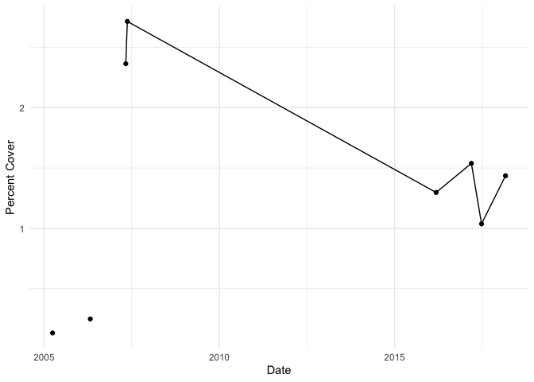

Data Cleaning and Testing
================
Micaela Chapuis
2024-12-08

In this document I will clean up my data and test the code that I will
then use in my Shiny app.

## Load Libraries

``` r
library(tidyverse)
library(here)
library(janitor) # clean up data
library(ggmap) # to make map of sites
library(ggspatial) # to add scale bars and compass arrows
library(ggrepel) # adding site labels to map
```

## Load Data

Also using the Janitor package to clean the column names

``` r
intertidal <- read_csv(here("Data", "OPIHI_2004_2020_Data.csv")) %>% clean_names() # read in and clean column names
```

## Data Cleaning

``` r
intertidal_oahu <- intertidal %>% 
                   filter(longitude > -158.35 & longitude < -157.6) %>% # keep only data collected on Oahu based on longitude
  
  # Now I want to remove sites that were only surveyed once:
                   group_by(location) %>% # group by location
                   filter(n() != 1) %>%  # n() gives the group size, so we filter to keep only cases when the size of the group is larger than 1 (so sites that appear more than once since each row is a survey date)
                   ungroup() %>% # ungroup
  
                   remove_empty("cols") # remove columns (species) with no observations
```

Fix some column formats

``` r
# turn this species into numeric
intertidal_oahu$wrangelia_elegantissima <- as.numeric(intertidal_oahu$wrangelia_elegantissima)

# turn date into Date format
intertidal_oahu$date <- mdy(intertidal_oahu$date)
```

Pivot to Long

``` r
intertidal_oahu_long <- intertidal_oahu %>%
  pivot_longer(
    cols = c("acanthophora_spicifera":"unknown_species", "difference_substrate_tallies"),  #columns to pivot
    names_to = "id", # new column with species names
    values_to = "num_points" # column with points counted
  )
```

``` r
# change all instances of "difference_substrate_tallies" to "substrate"
intertidal_oahu_long$id <- intertidal_oahu_long$id %>% str_replace_all("difference_substrate_tallies", "substrate")
```

Assign species to broader categories

``` r
red_algae <- c("acanthophora_spicifera", "ahnfeltiopsis_concinna", "ahnfeltiopsis_flabelliformis", "akalaphycus_setchelliae", "amansia_glomerata", "articulated_corallines", "asparagopsis_taxiformis", "botryocladia_skottsbergii", "centroceras_clavulatum",  "champia_parvula" , "chondria_spp", "coelothrix_irregularis", "dasya_spp", "dichotomaria_marginata", "galaxaura_spp", "galaxaura_or_liagora_sp", "gelid_spp", "gelidiella_acerosa", "gelidiopsis_intricata", "gelidiopsis_spp", "gelidium_pusillum", "gracilaria_salicornia", "grateloupia_spp", "griffithsia_spp", "hypnea_cervicornis", "hypnea_chordacea", "hypnea_musciformis",  "hypnea_spp", "laurencia_dendroidea", "laurencia_dotyi" , "laurencia_mcdermidiae", "laurencia_spp" , "liagora_spp", "martensia_spp", "palisada_parvipapillata", "portieria_hornemannii", "pterocladiella_caerulescens", "pterocladiella_capillacea", "pterocladiella_spp", "rhodymenia_spp", "spyridia_filamentosa", "trichogloea_spp", "wrangelia_elegantissima", "unknown_fuzzy", "unknown_red")

green_algae <- c("avrainvillea_amadelpha", "boodlea_composita", "bornetella_sphaerica", "bryopsis_spp", "caulerpa_racemosa", "caulerpa_sertularioides", "caulerpa_spp", "chaetomorpha_antennina", "cladophora_or_cladophoropsis_spp", "codium_arabicum", "codium_edule", "codium_spp", "coelothrix_irregularis", "dictyosphaeria_cavernosa", "dictyosphaeria_spp", "dictyosphaeria_versluysii", "halimeda_discoidea",  "microdictyon_setchellianum", "neomeris_spp", "parvocaulis_parvulus", "ulva_fasciata", "ulva_flexuosa", "ulva_spp", "unknown_green")

brown_algae <- c("asteronema_breviarticulatum", "brown_crust", "chnoospora_minima" , "colpomenia_sinuosa", "dictyopteris_spp", "dictyota_acutiloba" , "dictyota_sandvicensis", "dictyota_spp" , "hydroclathrus_clathratus", "lobophora_variegata", "padina_spp" , "sargassum_aquifolium", "sargassum_polyphyllum", "sargassum_spp", "sphacelaria_spp",  "turbinaria_ornata", "unknown_brown")

cyanobacteria <- c("cyanobacteria_spp", "leptolyngbya_crosbyana", "lyngbya_majuscula", "symploca_hydnoides", "unknown_cyanobacteria")

coral <- c("bleached_coral", "coral_spp")

CCA <- c("crustose_coralline_algae")

turf <- c("turf_spp")

mobile_invert <- c("actinopyga_varians", "amphipod_spp", "brittle_star", "calcinus_elegans", "calcinus_laevimanus", "calcinus_seurati", "cellana_exarata", "cellana_sandwicensis", "colobocentrotus_atratus", "conus_ebraeus", "conus_spp", "crab_spp", "drupa_morum", "echinolittorina_hawaiiensis", "echinometra_mathaei", "echinometra_oblonga", "echinometra_sp", "echinothrix_spp", "haminoea_cymbalum", "hermit_crab", "holothuria_atra", "holothuria_cinerascens", "holothuria_difficilis", "holothuria_hilla", "holothuria_spp", "littoraria_pintado",  "mauritia_mauritiana", "monetaria_caputserpentis", "morula_granulata", "morula_sp", "morula_uva", "nerita_picea", "ophiocoma_brevipes", "ophiocoma_erinaceus", "peasiella_tantilla", "siphonaria_normalis", "snail_spp", "stomatopod_spp", "stylocheilus_striatus", "tripneustes_gratilla", "unknown_polychaete" )

sessile_invert <- c("aiptasia_pulchella", "anthopleura_nigrescens", "barnacles_spp", "brachidontes_crebristriatus", "dendropoma_gregaria", "isognomon_californicum", "isognomon_perna", "nesochthamalus_intertextus", "palythoa_caesia" , "pennaria_disticha", "protopalythoa_spp", "sponge_spp", "thylacodes_variabilis", "tube_snail", "zoanthid_spp" )

unknown <- c("unknown_species")

substrate <- c("substrate")
```

Classify species into categories

``` r
intertidal_oahu_categories <- intertidal_oahu_long %>% 
                              mutate(category = case_when(id %in% red_algae ~ "Red Algae", # create a new column: if the species from the id column is in a certain vector (defined above), enter the specific category in the new column
                                                          id %in% green_algae ~ "Green Algae",
                                                          id %in% brown_algae ~ "Brown Algae",
                                                          id %in% cyanobacteria ~ "Cyanobacteria",
                                                          id %in% coral ~ "Coral",
                                                          id %in% CCA ~ "Crustose Coralline Algae",
                                                          id %in% turf ~ "Turf Algae",
                                                          id %in% mobile_invert ~ "Mobile Invertebrates",
                                                          id %in% sessile_invert ~ "Sessile Invertebrates",
                                                          id %in% unknown ~ "Unknown",
                                                          id %in% substrate ~ "Substrate"))

# write new csv that we will use in the Shiny App
#write.csv(intertidal_oahu_categories, here("Data", "opihi_data_clean.csv"))
```

Everything below here is just testing code/plots for the Shiny App. Code
may not be commented and/or may differ from what was actually used in
the Shiny App.

## Percent Cover by Species

``` r
intertidal_oahu_long$spp_percent_cover <- NA
```

``` r
for(i in 1:nrow(intertidal_oahu_long)) {

intertidal_oahu_long$spp_percent_cover[i] <-  (intertidal_oahu_long$num_points[i]/intertidal_oahu_long$total_number_of_tallies[i])*100
} # i didn't even need a for loop for this
```

#### One site

``` r
intertidal_oahu_long %>%
  filter(location == "Barbers Point") %>%
  filter(id == "crustose_coralline_algae") %>%
  group_by(date) %>%
  summarise(mean_pcover = mean(spp_percent_cover, na.rm = TRUE)) %>%
  ggplot(aes(x = date,
             y = mean_pcover)) +
  geom_point() + 
  geom_line() +
  theme_minimal() +
  labs(x = "Date",
       y = "Percent Cover")
```

<!-- -->

#### All sites

``` r
intertidal_oahu_long %>%
  #filter(location == "Barbers Point") %>%
  filter(id == "acanthophora_spicifera") %>%
  group_by(date, location) %>%
  summarise(mean_pcover = mean(spp_percent_cover, na.rm = TRUE)) %>%
  ggplot(aes(x = date,
             y = mean_pcover)) +
  facet_wrap(~location) +
  geom_point() + 
  geom_line() +
  theme_minimal() +
  labs(x = "Date",
       y = "Percent Cover")
```

<!-- -->

## Categories

### Percent Cover by Category

``` r
categories_pcover <- intertidal_oahu_categories %>% 
  group_by(date, location, category, total_number_of_tallies) %>% 
  summarise(cat_percent_cover = sum(num_points, na.rm = TRUE))
```

``` r
for(i in 1:nrow(categories_pcover)) {

categories_pcover$cat_percent_cover[i] <-  (categories_pcover$cat_percent_cover[i]/categories_pcover$total_number_of_tallies[i])*100
}
```

#### One Site

``` r
categories_pcover %>%
  filter(location == "Barbers Point") %>%
  filter(category == "Red Algae") %>%
  ggplot(aes(x = date,
             y = cat_percent_cover)) +
  #facet_wrap(~location) +
  geom_point() + 
  geom_line() +
  theme_minimal() +
  labs(x = "Date",
       y = "Percent Cover")
```

<!-- -->
\#### All sites

``` r
categories_pcover %>%
  #filter(location == "Barbers Point") %>%
  filter(category == "Red Algae") %>%
  ggplot(aes(x = date,
             y = cat_percent_cover)) +
  facet_wrap(~location) +
  geom_point() + 
  geom_line() +
  theme_minimal() +
  labs(x = "Date",
       y = "Percent Cover")
```

<!-- -->

### Relative Abundance Plot

``` r
# Change order levels 
intertidal_oahu_categories$category <- factor(intertidal_oahu_categories$category, 
                                              levels=c("Red Algae", "Crustose Coralline Algae", "Brown Algae", "Green Algae", "Turf Algae", "Cyanobacteria",  "Coral", "Sessile Invertebrates", "Mobile Invertebrates", "Substrate", "Unknown" ))
```

``` r
intertidal_oahu_categories %>%
  
  filter(num_points > 0) %>%  # only keep cases when points are positive (there's a few cases were the number of points recorded exceeds the number of points there should be based on the number of quadrats, so when calculate substrate points we get a negative value)
  
  filter(location == "Ewa Beach") %>% # pick which location to plot
  
  ggplot(aes(x=as.factor(date), 
             y=num_points, 
             fill=category, 
             color=category)) + 
  geom_bar(stat="identity", position="fill") + # stacked bars
  theme_minimal() +  # theme
  theme(axis.text.x = element_text(angle= 45, vjust = 1.1, hjust = 1)) + # angle of the date text
  labs(x = "Date", # labels
       y="Relative Abundance",
       fill = "Category") +
  
  guides(color = "none") + # keep only legend for fill since fill and color are the same
  
  scale_fill_manual(values = c("Red Algae" = "indianred2", # specify fill colors for each category
                               "Green Algae" = "olivedrab",
                               "Brown Algae" = "sienna",
                               "Cyanobacteria" = "cadetblue4",
                               "Crustose Coralline Algae" = "lightpink2", 
                               "Turf Algae" = "darkseagreen3",
                               "Coral" = "slateblue",
                               "Mobile Invertebrates" = "burlywood",
                               "Sessile Invertebrates" = "mediumpurple2",
                               "Substrate" = "mistyrose4",
                               "Unknown" = "grey20")) +

  scale_color_manual(values = c("Red Algae" = "indianred2", # specify line colors for each category (same as fill)
                               "Green Algae" = "olivedrab",
                               "Brown Algae" = "sienna",
                               "Cyanobacteria" = "cadetblue4",
                               "Crustose Coralline Algae" = "lightpink2", 
                               "Turf Algae" = "darkseagreen3",
                               "Coral" = "slateblue",
                               "Mobile Invertebrates" = "burlywood",
                               "Sessile Invertebrates" = "mediumpurple2",
                               "Substrate" = "mistyrose4",
                               "Unknown" = "grey20"))
```

<!-- -->

## Map

Make a df for just sites and coordinates

``` r
opihi_coords <-  intertidal_oahu %>% distinct(location, .keep_all = TRUE) # keeping one row for each distinct location, and keeping other columns because we need to keep lat and long
```

Fix site names

``` r
old_names <- c("Kahana Bay", "Diamond Head", "Sand Island", "Barbers Point", "Turtle Bay", "Ewa Beach", "Sandy Beach", "Maili Beach", "Baby Makapuu") # names currently in the df
new_names <- c("Kahana Bay", "Diamond Head", "Sand Island", "Barber's Point", "Turtle Bay", "ʻEwa Beach", "Sandy Beach", "Māʻili Beach", "Baby Makapuʻu") # names I want them replaced with

opihi_coords$location <- replace(opihi_coords$location, opihi_coords$location %in% old_names, new_names) # replace names from the old_names vector with names from the new_names vector
```

Make a map

``` r
opihi_map <- get_map(c(lon = -157.976, lat = 21.467), zoom = 10, maptype = "satellite") # get a satellite map centered at the specified coordinates (roughly center of Oahu)
```

``` r
ggmap(opihi_map) +
    geom_point(data = opihi_coords, # use the data opihi_coords
               aes(x = longitude, # plot each site using their lat and long
                   y = latitude),
                   color = "gold",
                   size = 3,
                   alpha = 0.7) + 
    geom_label_repel(data = opihi_coords, # site labels, using repel so they don't overlap
                     aes(x = longitude,
                         y = latitude,
                         label = location),
                     size = 4) +
    theme_minimal() +
    labs(x = "Longitude", # set labels and title
         y = "Latitude") +
  
# Add scale bar
    annotation_scale(bar_cols = c("black", "white"), # add scale bar, make colors black and white
                     location = "tr",  # put it in the top right
                     text_col = "white") + # make text color white so it can be seen
  
# Add North Arrow
    annotation_north_arrow(location = "tl",# add a north arrow in top left
                           height = unit(1, "cm"), # set size
                           width = unit(1, "cm"),
                           style = north_arrow_fancy_orienteering(text_col = 'white', # set type of arrow and colors for all its parts
                                                                  line_col = 'white',
                                                                  fill = 'white')) +
    coord_sf(crs = 4326) # necessary crs for scale bar to work
```

<!-- -->
